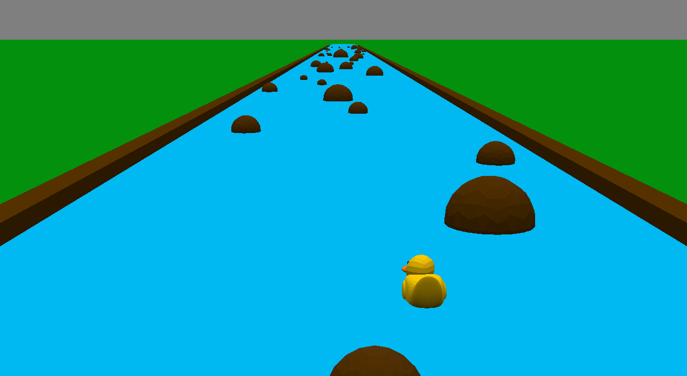

# Epic Duck Game

Author: Lawrence Chen

Design: In this game, you are a duck getting pushed by the current of a river. Your goal is to dodge the boulders to survive as long as possible. This is a twist on Temple Run with continuous controls.

Screen Shot:

How To Play:

Use left and right keys to move, space to move faster. If you collide with a boulder, the game ends and you can press R to restart. 

This game was built with [NEST](NEST.md).
